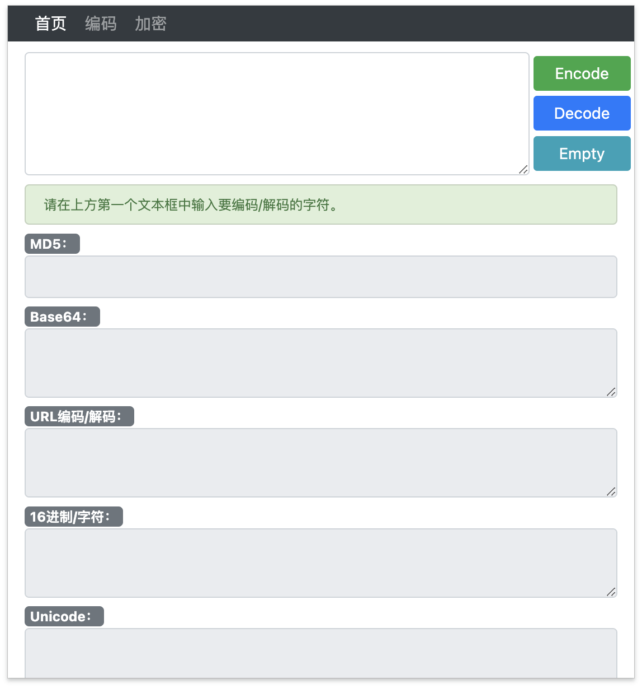
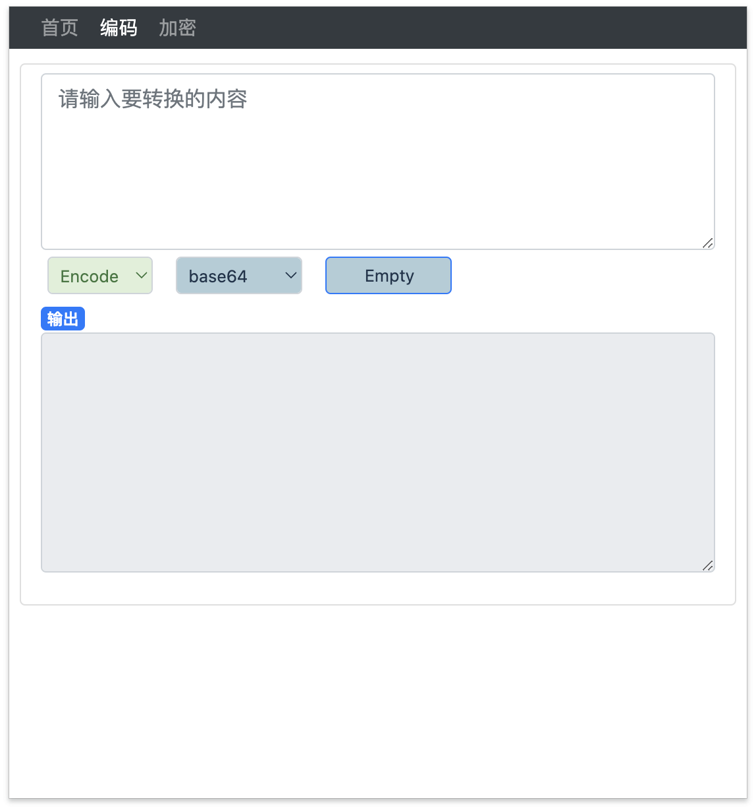
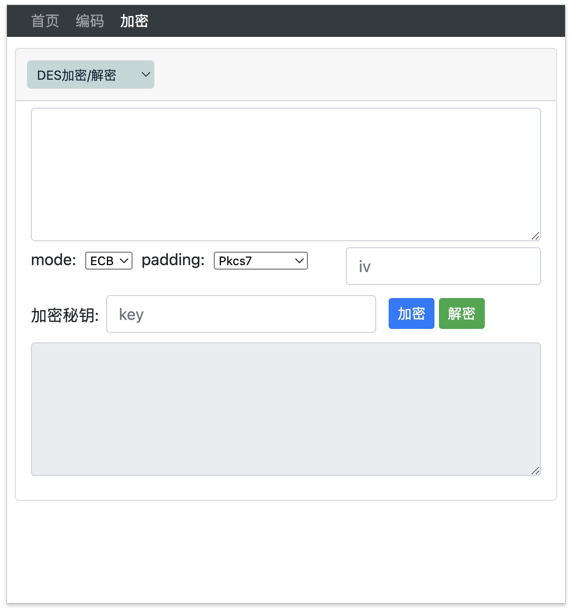
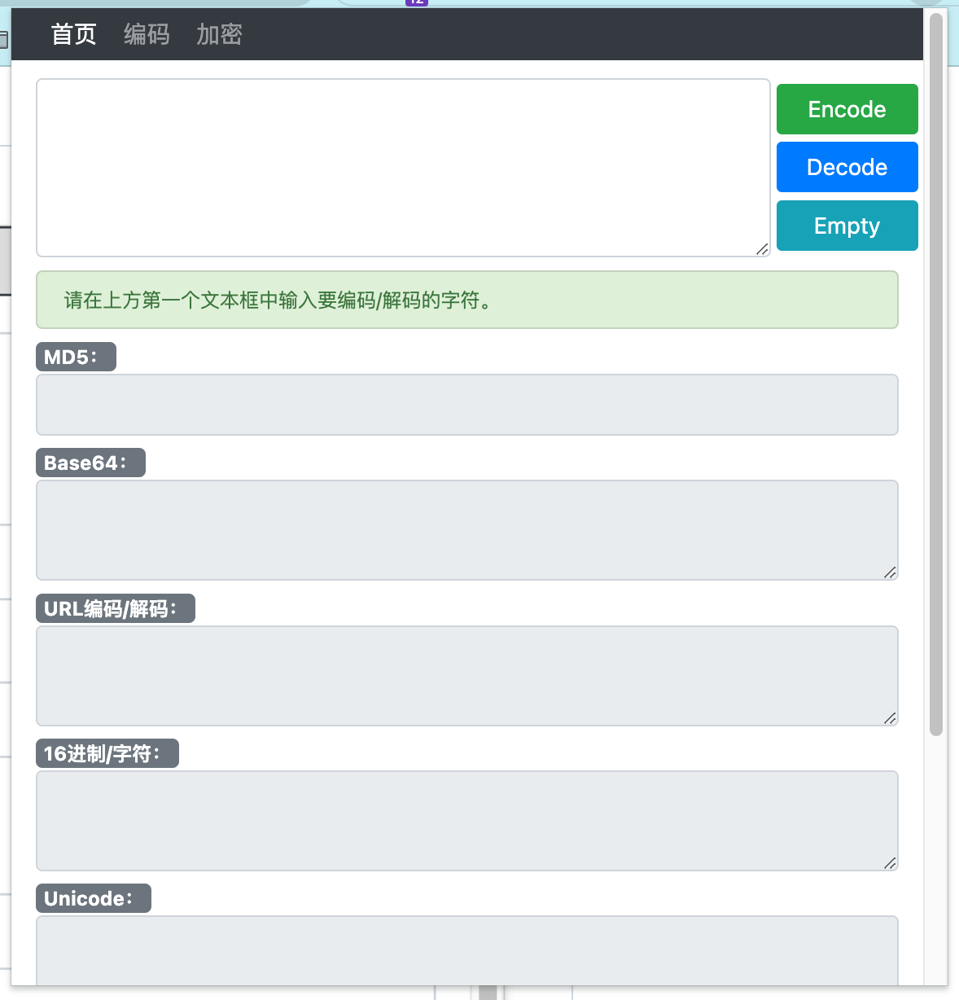
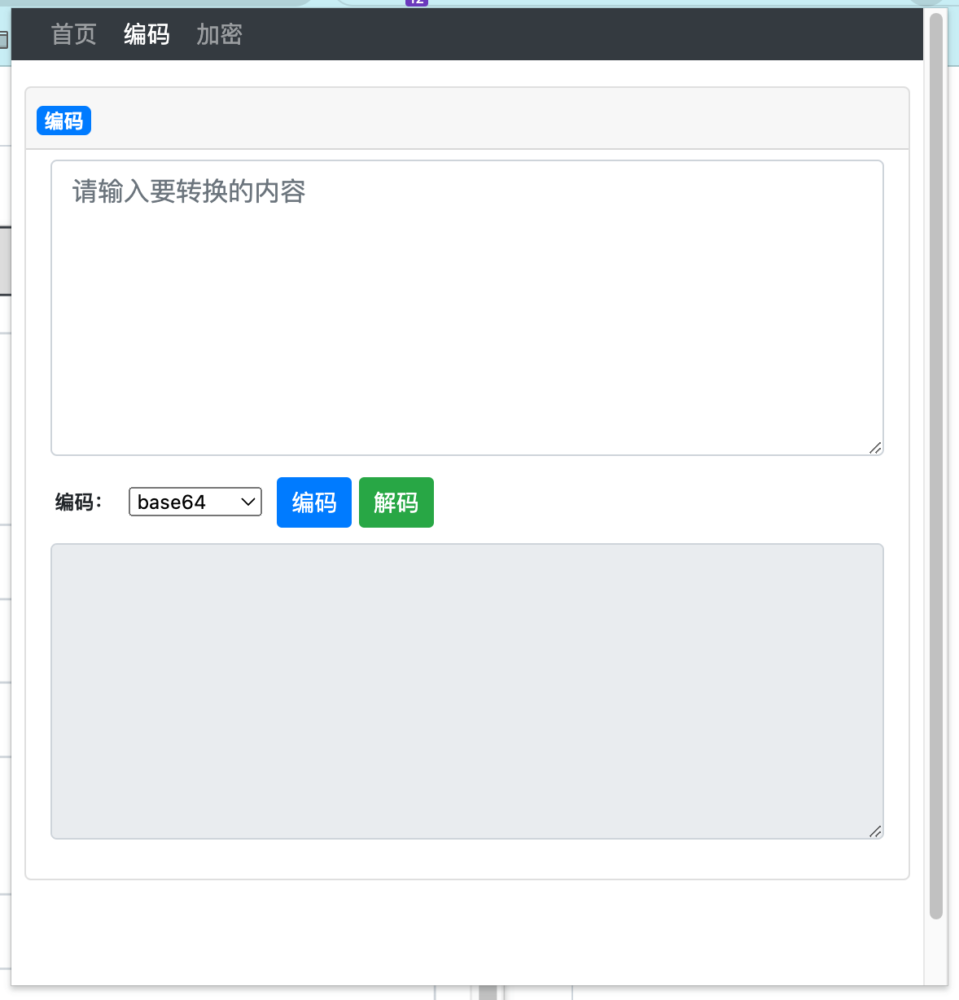
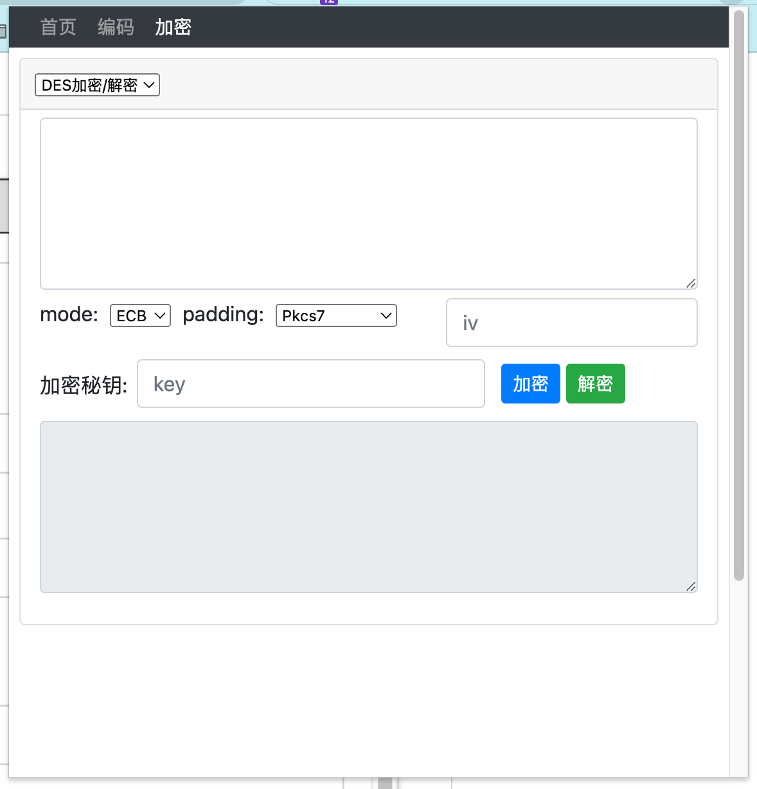

# Flee 插件
- flee3.1
- 一款Chrome 浏览器插件。
- 目前内置解码小工具，支持md5、base64、url、16进制转字符串、Unicode和UTF-8等编码。
- 可用于CTF比赛。

## Flee 3.1 更新内容
- 修复上一个版本的bug。
- 优化ui。
- 对于“编码”功能页面添加监听功能，每次输入新的数据自动生成编码。
- 对于“编码”功能页面添加数据本地存储功能，代码架构进行了大部分重构。

## 支持的编码

| 编码    | 完成 | 编码    | 完成 |
| ------- | ------- | ------- | ------- |
| MD5 | ✅| sha1 | ✅|
| Base64 | ✅ |sha3 | ✅|
| Base32 | ✅|sha224 | ✅|
| URL编码 | ✅|sha256 | ✅|
| Hex编码 | ✅|sha384 | ✅|
| Unicode编码| ✅|sha512 | ✅|
| UTF-8 | ✅|morse莫斯编码 | ✅|

> 更多编码后续将支持！

##  安装插件
> chrome扩展市场审核太不方便了就没上传，请手动安装。
1. 下载源码

``` bash
git clone https://github.com/perlh/Flee.git
```

2. Chrome扩展程序 -> 加载已解压扩展程序 -> 选择`Flee`文件夹
3. 确定

## Flee_v3.1插件新UI界面

#### 1、常用


#### 2、 编码



#### 3、加密



## Flee_v3.0插件旧UI界面

#### 1、常用

#### 2、 编码


#### 3、加密

