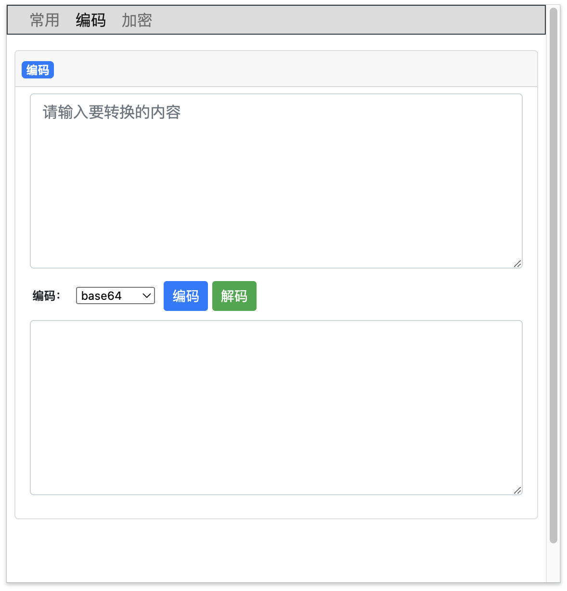
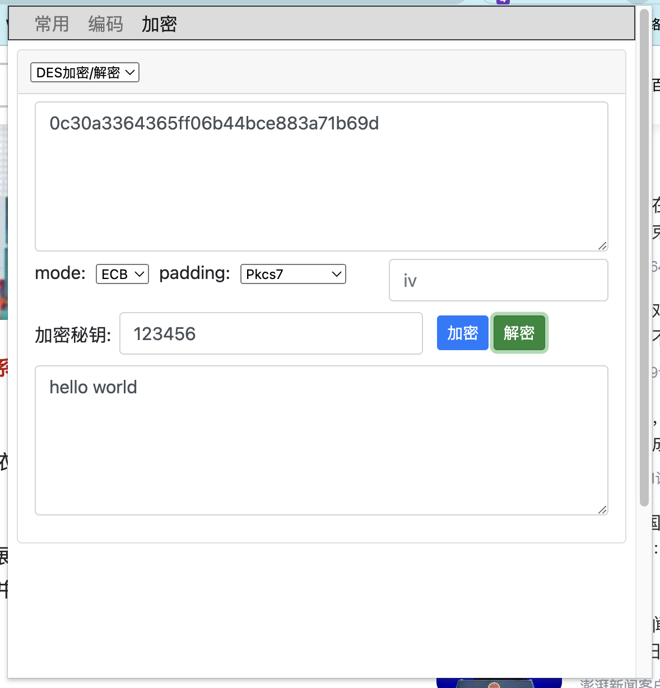

# EasyTools
- 一款Chrome 浏览器插件。
- 目前内置解码小工具，支持md5、base64、url编码、16进制转字符串、Unicode编码、UTF-8编码。
- CTF工具。

## 支持的编码

| 编码    | 列2标题 |
| ------- | ------- |
| 单元格1 | ✅|
| 单元格4 | ❌ |

## 常用

## 编码

## 加密

# 安装插件
1. 下载源码
2. 解压
3. Chrome扩展程序 -> 加载已解压扩展程序 -> 选择EasyTools文件夹
4. 确定