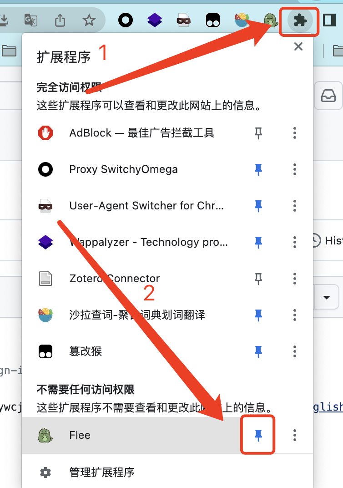
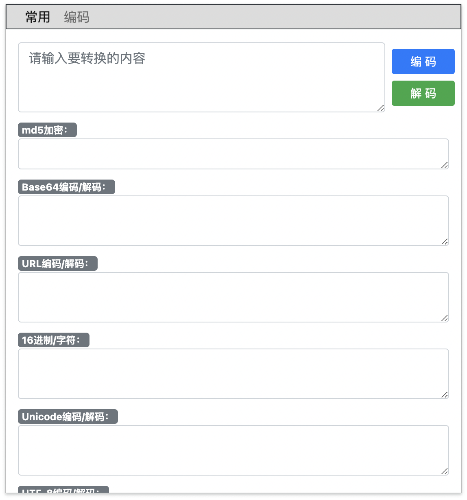
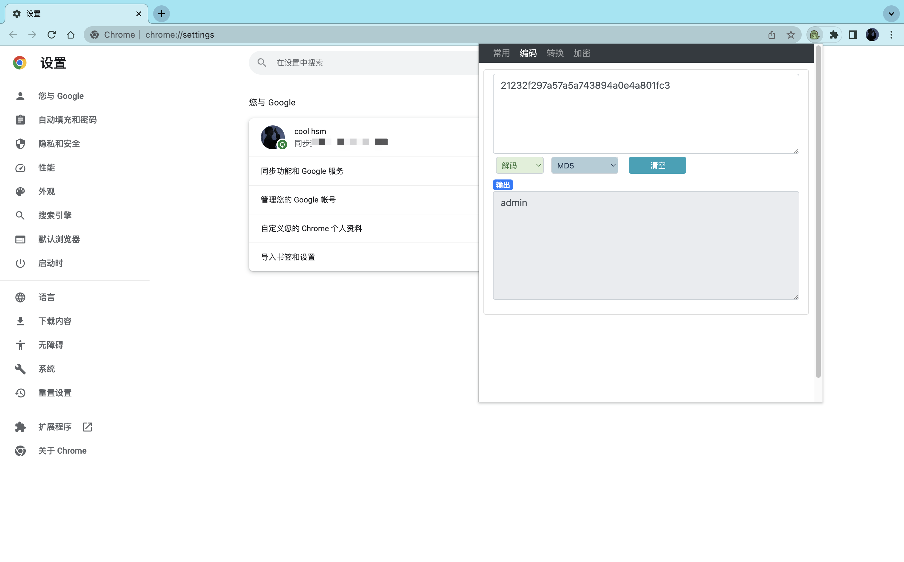
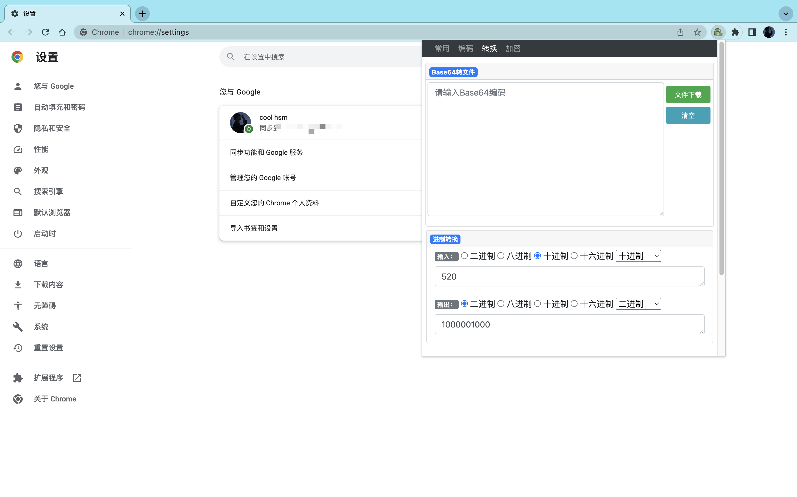

### Flee 插件
Flee插件是一款功能强大的Chrome浏览器插件，支持多种编码类型的转换和加密解密操作。使用Flee插件，您可以方便地进行各种编码和转换操作，也可以使用DES算法进行加密解密操作，**同时支持MD5解密操作**（通过调用API实现）。如果您需要进行这些操作，可以尝试使用Flee插件，它可以为您提供方便快捷的解决方案。
- 目前内置解码小工具，支持**Base64**、**Base32**、**Base16**、**Base58**、**Base62**、**URL**、**ASCII**、**Unicode**、**UTF-8**、**morse**的编码和解码。
- 支持各种哈希计算，包括但不限于**SHA1**、**SHA3**、**SHA224**、**SHA256**、**SHA384**、**SHA512**和商密**SM3**等哈希计算。
- 支持base64转文件等功能、进制转换、支持常见的md5密文解密（通过调用API）等功能。尤其适合Hacker食用。
- 支持DES各种加密模式的加解密功能。

###  安装插件
> chrome扩展市场审核太不方便了就没上传，请手动安装。
1. 下载源码，将Flee文件夹保存在某个目录下。
    ``` bash
    git clone https://github.com/perlh/Flee.git
    ```
2. 在地址栏输入 **chrome://extensions/**，按下回车键进入**Chrome扩展程序**页面 -> **加载已解压扩展程序** -> 选择`Flee`文件夹。

3. 点击确定。
4. 在浏览器中设置将Flee插件固定在导航栏上。

5. 如果您想要卸载Flee插件，可以在扩展程序页面找到它，点击“删除”按钮即可。


### 功能界面







