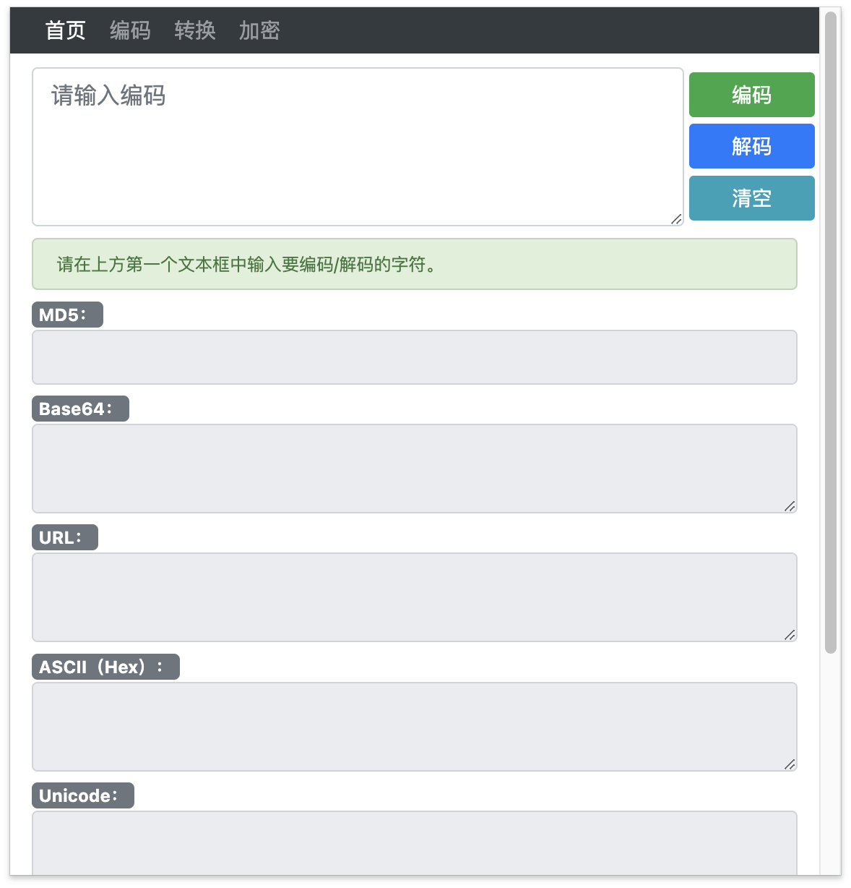
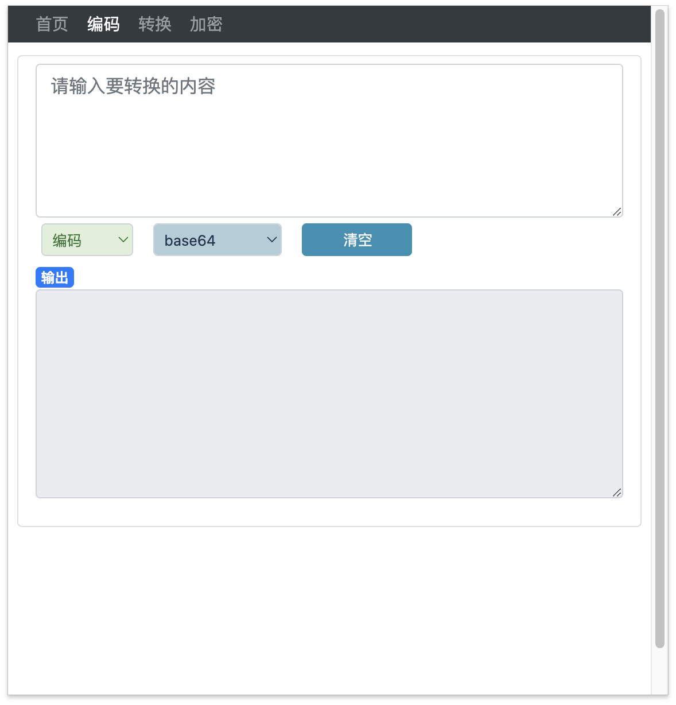
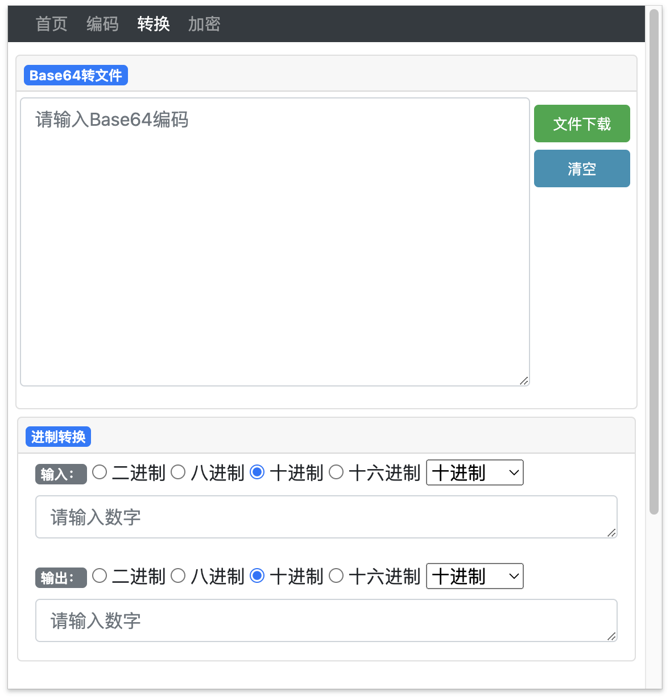

# Flee 插件
- flee3.2
- 一款Chrome 浏览器插件。
- 目前内置解码小工具，支持md5、base64、base32、url、ASCII、Unicode和UTF-8等编码。
- 增加base64转文件功能。
- 二进制、八进制、十进制、十六进制相互转换。
- 支持DES加密与解密。
- 支持MD5解密（调用API）

## 支持的编码
### 编码

| 编码    | 完成 | 编码    | 完成 |
| ------- | ------- | ------- | ------- |
| MD5 | ✅| sha1 | ✅|
| Base64 | ✅ |sha3 | ✅|
| Base16 | ✅ |base58 | ✅|
| Base62 | ✅ |morse莫斯编码| ✅|
| Base32 | ✅|sha224 | ✅|
| URL编码 | ✅|sha256 | ✅|
| Hex编码 | ✅|sha384 | ✅|
| Unicode编码| ✅|sha512 | ✅|
| UTF-8 | ✅| sm3| ✅|

### 转换
- base64转文件。
- 二进制、八进制、十进制、十六进制相互转换。

### 加密
- DES加密

##  安装插件
> chrome扩展市场审核太不方便了就没上传，请手动安装。
1. 下载源码

``` bash
git clone https://github.com/perlh/Flee.git
```

2. Chrome扩展程序 -> 加载已解压扩展程序 -> 选择`Flee`文件夹
3. 确定

## Flee_v3.2

1. 首页


2. 编码


3. 转换

4. 加密

